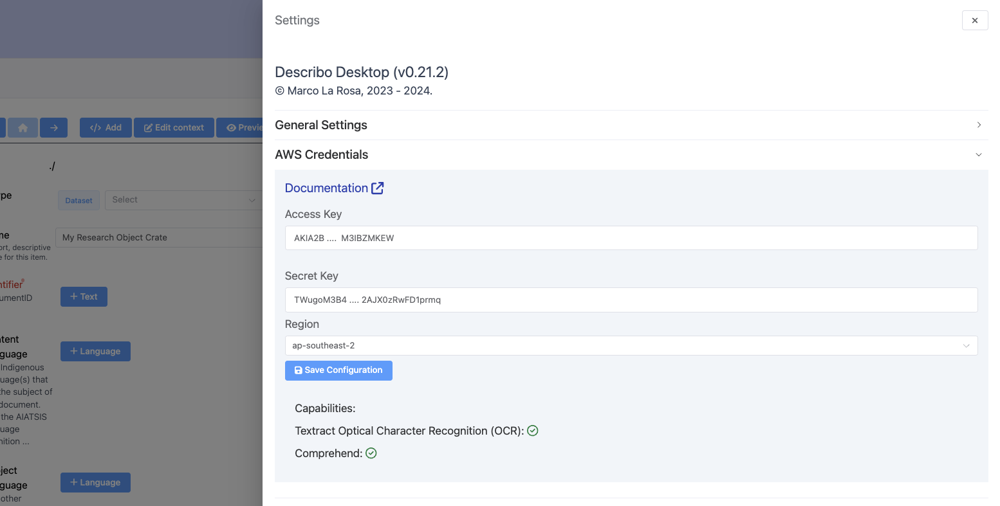

# Configuring AWS Integration

In order to use AWS for `Optical Character Recognition (OCR)` and `named entity recognition`,
credentials with the appropriate permissions are required. The easiest way to do this is to send an
email to your local IT department to provision the required credentials for you.

An example message is shown following:

::: info

Hi,

Please provision AWS IAM credentials for use with an application I use for my research. Please also
indicate which AWS region to use (e.g. ap-southeast-2)

The product is called Describo and you can read about it @ https://describo.github.io.

Describo requires AWS credentials with permission to access IAM (to determine what has been
enabled), Textract and Comprehend. The exact permissions required are detailed @
https://describo.github.io/documentation/guide/configuration/setting-up-aws.html.

Please consult the section 'Fine Grained Permissions' on that page for what is required.

Thanks,

\<YOU\>

:::

## Setting up Describo

Once you have the credentials and region information, you need to put that information into
Describo.

Open `Settings` and then the section `AWS Credentials`.

<div class="flex flex-row border border-slate-200">
    
</div>

Put the credentials as provided to you in the respective fields and then choose the region (which
should also have been provided).

When you press save Describo will check that the correct permissions have been enabled. If they
have, you should see a green tick next to each Capability in the bottom section.

## Fine Grained Permissions

If choosing permissions explicitly, the following are required.

```JSON
{
    "Version": "2012-10-17",
    "Statement": [
        {
            "Sid": "VisualEditor0",
            "Effect": "Allow",
            "Action": [
                "iam:GetPolicyVersion",
                "iam:GetPolicy",
                "iam:GetUser",
                "iam:GetUserPolicy",
                "iam:ListGroupsForUser",
                "iam:ListAttachedUserPolicies",
                "iam:ListUserPolicies",
            ],
            "Resource": [
               ...the specific user
            ]
        },
        {
            "Sid": "VisualEditor1",
            "Effect": "Allow",
            "Action": [
                "comprehend:DetectDominantLanguage",
                "comprehend:DetectEntities",
                "comprehend:DetectKeyPhrases",
                "comprehend:DetectPiiEntities",
                "comprehend:DetectSentiment",
                "comprehend:DetectTargetedSentiment",
                "comprehend:DetectToxicContent",
                "s3:GetObject",
                "textract:DetectDocumentText",
                "textract:AnalyzeExpense",
                "textract:AnalyzeDocument",
                "textract:AnalyzeID"
            ],
            "Resource": "*"
        }
    ]
}
```

## Broad permissions

Assign the following policies to the user:

-   AmazonTextractFullAccess
-   ComprehendReadOnly
-   IAMReadOnlyAccess
