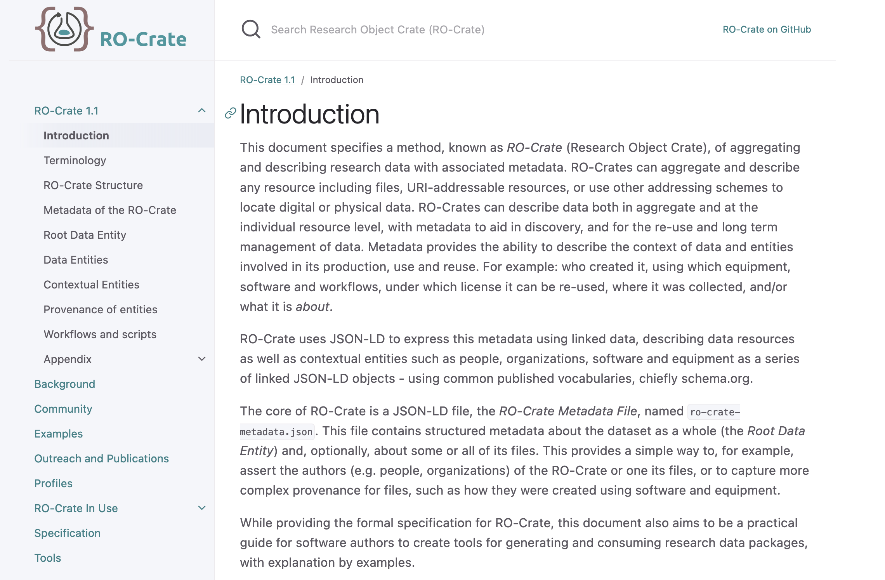
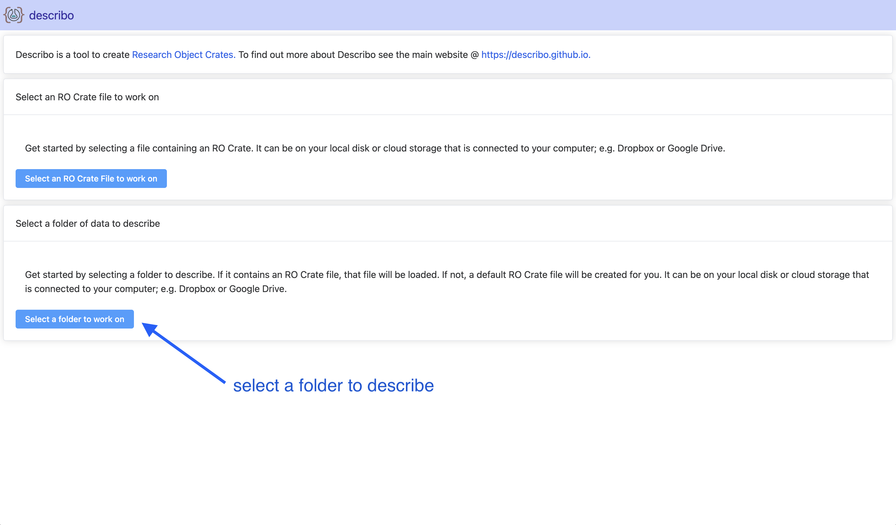
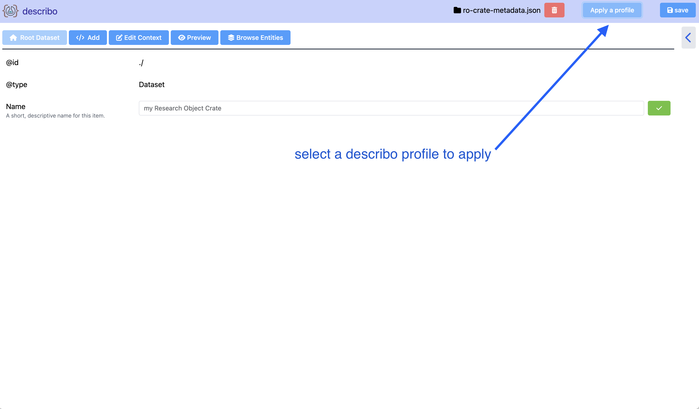
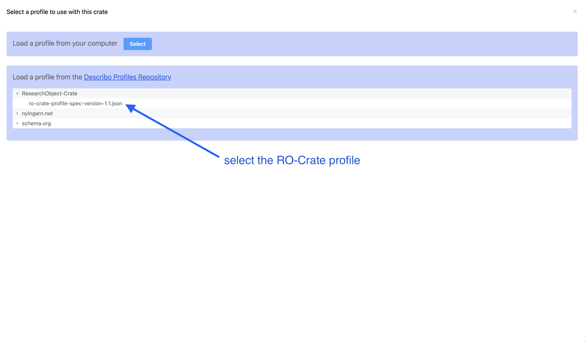
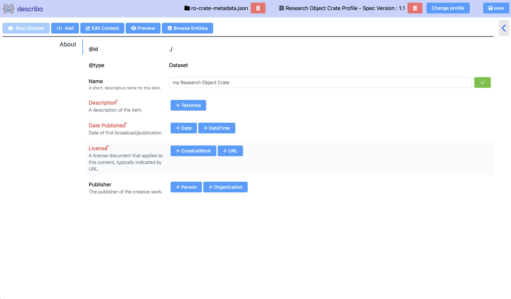
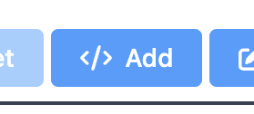
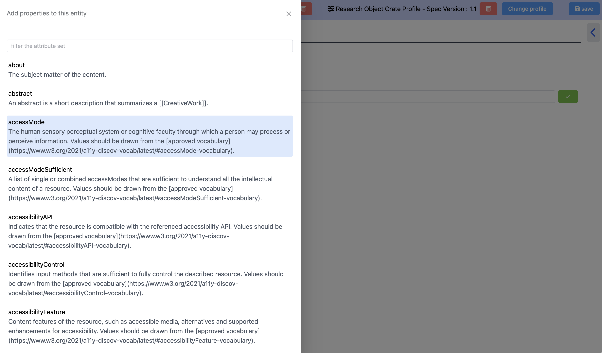
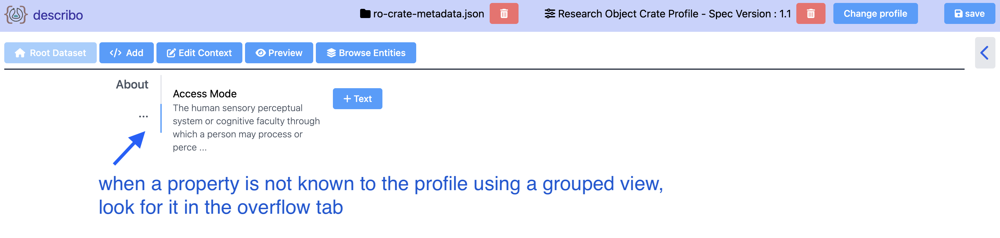

# Beginner Tutorial: Research Object Crates (RO-Crate) and Describo

[[toc]]

## Introduction

The RO-Crate specification describes "a method of aggregating and describing research data with
associated metadata".
[https://www.researchobject.org/ro-crate/1.1/introduction.html](https://www.researchobject.org/ro-crate/1.1/introduction.html)

In this 5 minute tutorial, you will get started describing your data as RO-Crates!

    

## Audience: about you

You've heard about these nifty RO-Crate things and want to start describing your data in an open and
spec conformant way. Maybe you can explain what JSON-LD is and maybe you've looked at the spec but
your core interest here is that you want to describe your research data.

### Useful links where you can learn more

(this is just for reference, you won't be tested on this)

-   [RO-Crate specification](https://www.researchobject.org/ro-crate/specification.html)
-   [JSON-LD](https://json-ld.org/)
-   [schema.org](https://schema.org/)

## Start the Describo web application

[Describo Web](https://describo.github.io/web). (Remember, it only works in Google Chrome and
Microsoft Edge for now.)

::: tip

Describo web is good for getting started quickly and easily. You can inspect an RO-Crate and load
profiles to work with the data. But Desktop has more capabilities.

:::

In the application, select a folder to describe.

    

## Apply the RO-Crate profile

The main description view. A default RO-Crate describo profile has been created for you.

Apply the profile.

    

## Profile Selector

The profile selector. Locate the RO-Crate profile and select it.

    

## Describe your data

When the RO-Crate profile has been applied, you will be presented with a view that contains the
absolute bare minimum required to describe your data as an RO-Crate.

### Useful information

-   [Root data entity](https://www.researchobject.org/ro-crate/1.1/root-data-entity.html)
-   [Contextual entities](https://www.researchobject.org/ro-crate/1.1/contextual-entities.html)
-   [Data entities](https://www.researchobject.org/ro-crate/1.1/data-entities.html)

    

## Go further: describe more

Click the add button in the toolbar and inject properties into the data.

    

        
    

The properties you can inject come from schema.org and the describo profile if one is applied. They
are defined on the type of data you are working with. In this case a Dataset. When you add the
property Describo will tell you what type of data it expects.

    

## Where did that property go?

With a profile that defines a grouped interface, for example the RO-Crate profile, extra properties
that you add will be visible in the '...' tab. Don't worry, just remove the profile and you get a
list view with all of your properties, sorted alphabetically. Or go back to the tabbed view. Work
the way that suits you best.

    

## And that's an RO-Crate!

Well done, you created an RO-Crate by describing your data in a standard, spec compliant way!

<i class="fa-solid fa-champagne-glasses text-yellow-500 fa-4x"></i>
