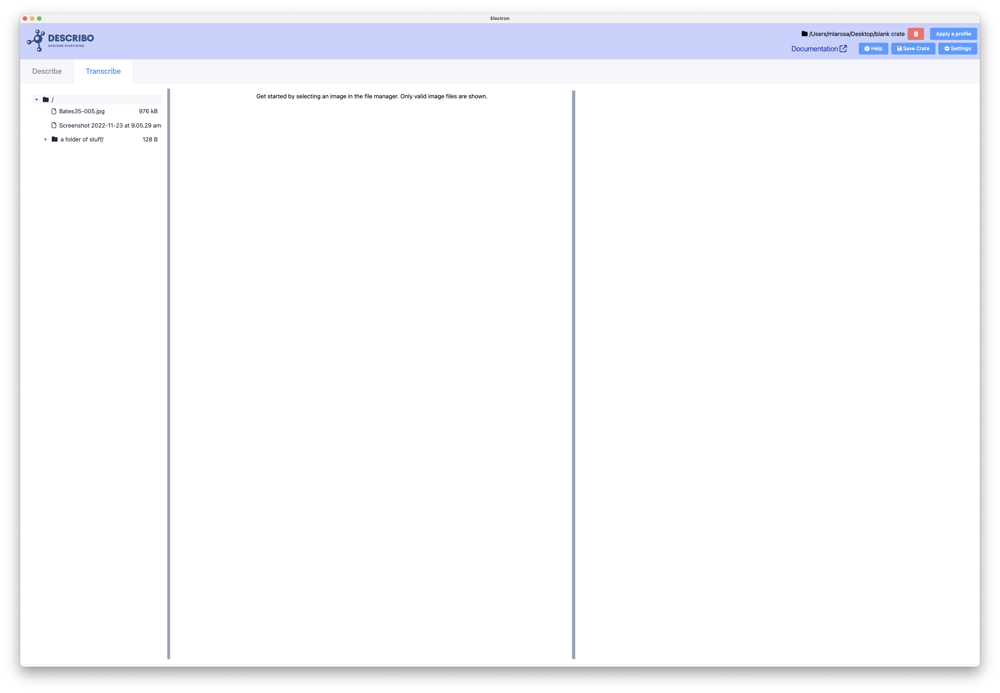
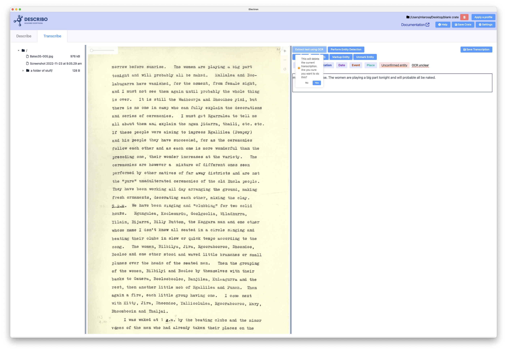
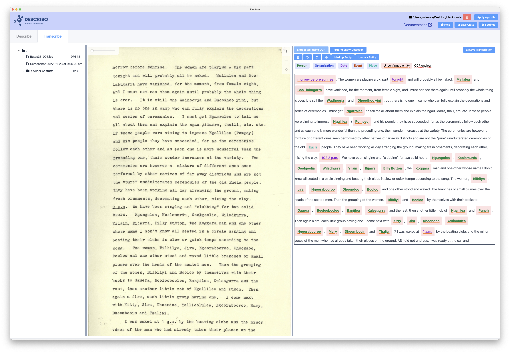
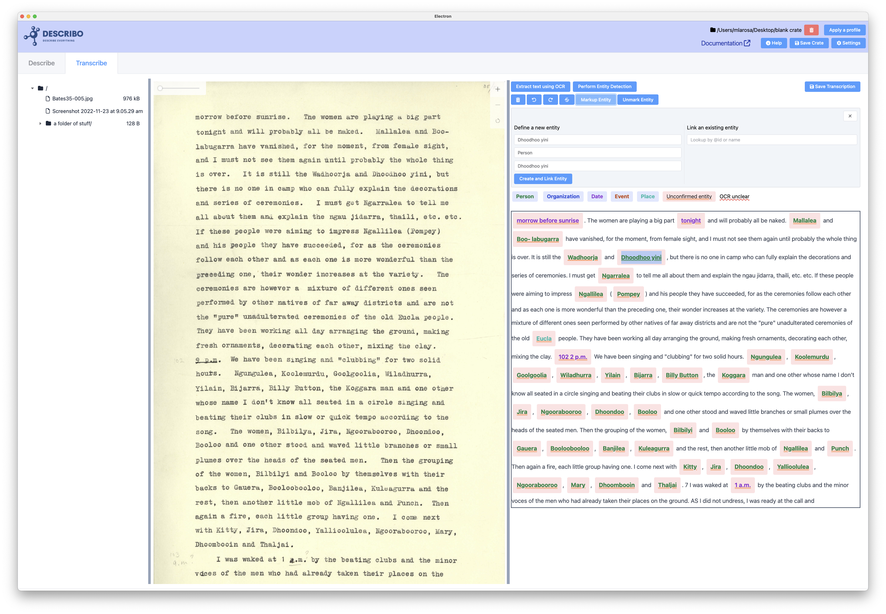
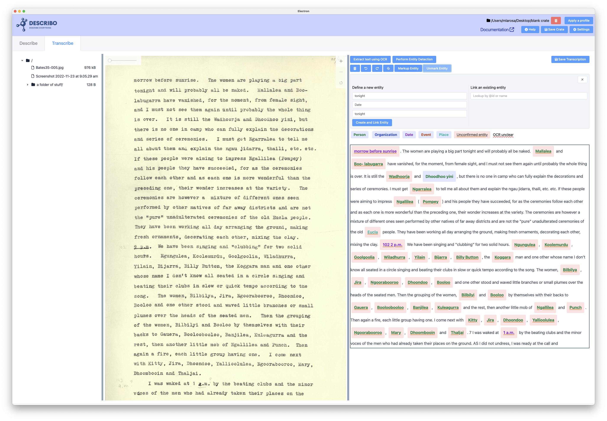
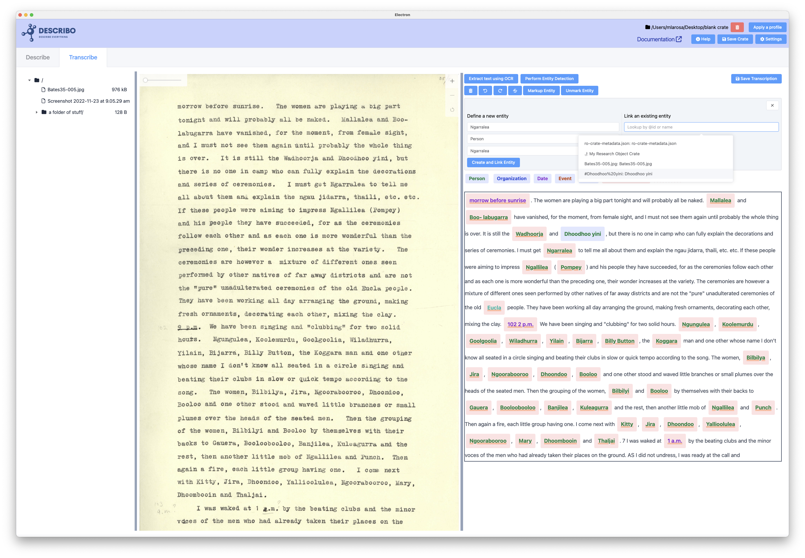
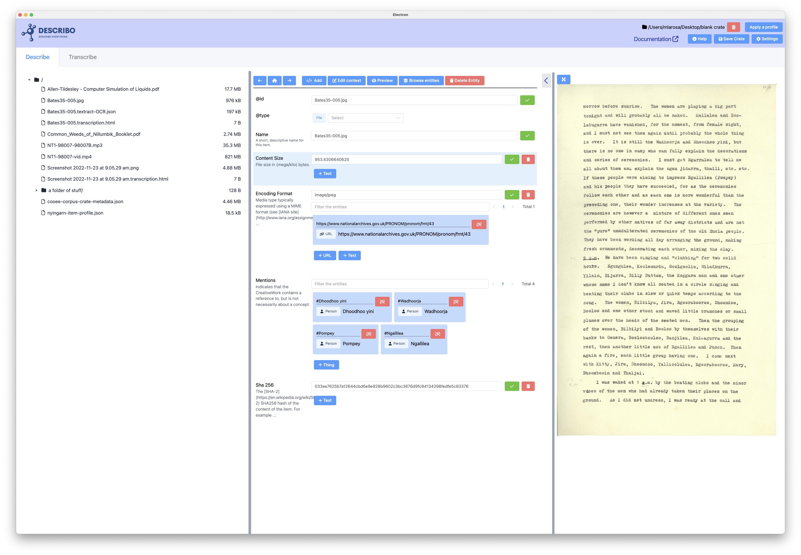
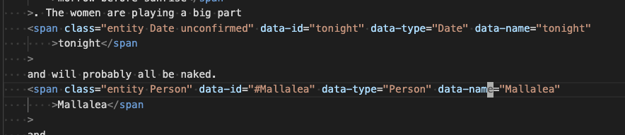

# Content Transcription and Analysis

As a **#HASS** researcher you are likely collecting images of manuscripts and periodicals that you
wish to transcribe in order to find, describe and analyse the narratives in that data. Typically,
you might start by making notes about the people and organisations (who), events (what), dates
(when) and places (where) described in the content in order to establish a context for the content.

With Describo, this process is simplified significantly with tools to mark up the entities in the
content in the RO-Crate as entities attached to the specific file.

## The transcription Tab

When you navigate to the transcription tab you will see a 3 pane layout. In the first pane is the
file browser showing only images in your folder. For now, Describo can only work with image formats;
specifically files with the extension 'tif', 'tiff', 'jpg', 'jpeg', 'webp' or 'png'.
{data-zoomable}.

Get started by selecting an image file. The file will be loaded into the middle panel and the third
panel will become a text editor.

{data-zoomable}

At this point you can immediately start transcribing the content of the image into the editor window
in the right hand panel.

Along the top of the editor window are the controls including sending the page through OCR;
performing entity detection (for manually transcribed content); deleting the text; undo and redo and
marking up the entities in the page.

At the bottom of the controls is a legend for the different markup that is applied to the entities.

::: warning

The controls to extract text using OCR and perform entity detection are not enabled unless you've
provided AWS credentials to Describo. To read about how to do this see:
[/guide/configuration/setting-up-aws.html](/guide/configuration/setting-up-aws.html)

:::

## Performing OCR

OCR (Optical Character Recognition) is provided by the AWS Textract service. Testing has revealed
that it can read type written pages with almost perfect accuracy and do a more then admirable job on
handwritten content. So, you probably always want to try this first and then fix the results unless
the content is particularly difficult to read.

::: tip

If you can't read the text (for example because it's complex handwriting or the contrast is bad)
then it's likely Textract will struggle as well. In those cases you probably just want to manually
transcribe the text bit by bit but since the cost per page is on the order of fractions of a cent,
having a go won't cost much.

:::

In the following two images, the control `Extract text using OCR` is pressed and after a few
moments, the text is written into the transcription editor.

{data-zoomable}
{data-zoomable}

Immediately we notice a few things. The entities are marked up in the text. Dates are purple whilst
People are green. The background for each entity is red meaning that the entitiy needs to be
confirmed by you.

Selecting an entity in the text ("Dhoodhoo yini", third line), and then pressing `Markup Entity` in
the controls allows you to mark up that entity in the RO-Crate. In the following example we are
saying that that entity in the text is a Person with name `Dhoodhoo yini`.

{data-zoomable}

After pressing `Create and Link Entity` the background has changed to indicate that the entity has
been confirmed by you.

Likewise, entities can be unmarked. In the following example `tonight` is selected in the first line
and then the button `Unmark Entity` is pressed. The editor then removes the markup from the text.

You can also select an entity in the text and associate it to an entity that has already been
defined in the metadata. In this case, pressing the dropdown under `Link an existing entity` gives
us a searchable list of the entities already defined in the metadata. Selecting one sets marks up
that entity.

## Content markup

In this way, you can go through and markup all of the entities in the text. In the following example
four entities have been marked up as People: Wadhoorja, Dhoodhoo yini, Ngallilea, Pompey.

And when we go back to the `Describe` tab we see that the entities are listed in the `mentions`
property against the file. On this tab we can also see some extra files in the file manager on the
left. The original image is `Bates35-005.jpg` and alongside it is `Bates35-005.textract-OCR.json`
and `Bates35-005.transcription.html`. The file named textract OCR contains the textract data and the
html file is the marked up transcription.

If we look at the content of the html file we see that the entity data is marked up as HTML data
attributes. In the following example, the first entity has the class `unconfirmed` whilst the second
does not meaning that the second has been confirmed.

