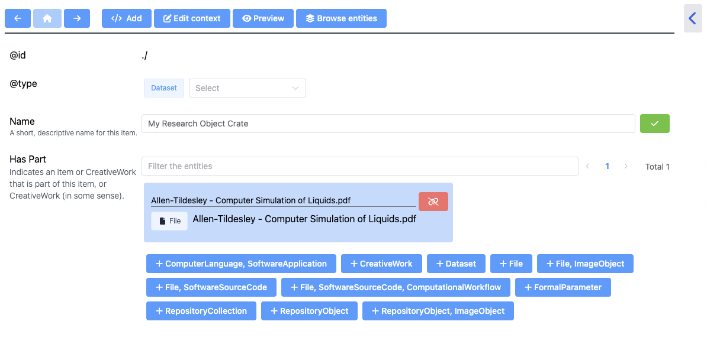

# Working with an RO-Crate

When you select a folder, if there's a file 'ro-crate-metadata.json' the content will be loaded into
the application. If there isn't, a skeleton crate file will be created and loaded. The root dataset
will then be shown. The view is divided into three sections: top left is the file manager and
underneath it is where file previews will be shown; the main view on the right is the metadata
editor. 

## Navigation bar

In the navigation bar the current folder is shown along with controls to apply a profile, save the
current the work and access the settings. 

## Main editor window

The main editor window has a controls bar along the top. On it there are controls to navigate
through the entities in the crate; add properties to the current entity; edit the context; preview
the crate data; browse the entities in the crate; and view the linkages to the current entity.

### Navigating to an entity

The main editor window which displays the properties defined for this entity. Selecting an entity
(e.g. select the File entity shown) navigates to that entity.

### Adding properties to an entity

When adding properties, a dialog opens with all of the properties that can be defined for the
current entity. The list is filterable and each property shows the type of data that can be added,
e.g. abstract accepts Text. Multiple properties can be added before closing the dialog.

The view after adding the 'About' and 'Abstract' properties.

### Creating a new entity

Selecting the 'Thing' button allows defining a new entity of type 'Thing'. The control also looks
for other entities of type Thing in the current crate and elsewhere, and if there are any, they will
be available for selection. 

## File handling and preview

Selecting an entity navigates to it (in this case we've navigated to the File entity that was
defined) and displays a preview of it where possible. Note that the file size, encoding and file
hash is automatically set by Describo. The encoding and hash are determined by the excellent
<a href="https://www.itforarchivists.com/" target="_blank">Siegfried tool.</a>

---
